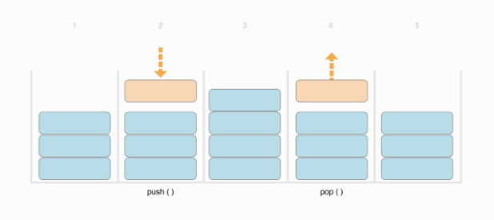
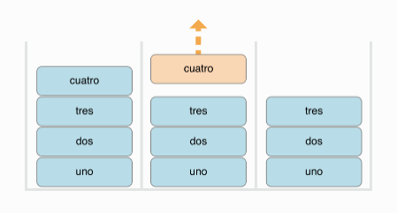

# 泛型

------

本頁包含內容：

- [泛型所解決的問題](#the_problem_that_generics_solve)
- [泛型函式](#generic_functions)
- [型別參數](#type_parameters)
- [命名型別參數](#naming_type_parameters)
- [泛型型別](#generic_types)
- [型別約束](#type_constraints)
- [關聯型別](#associated_types)
- [`Where`語句](#where_clauses)

*泛型程式碼*可以讓你寫出根據自我需求定義、適用於任何型別的，靈活且可重用的函式和型別。它的可以讓你避免重複的程式碼，用一種清晰和抽像的方式來表達程式碼的意圖。

泛型是 Swift 強大特征中的其中一個，許多 Swift 標準函式庫是通過泛型程式碼構建出來的。事實上，泛型的使用貫穿了整本語言手冊，只是你沒有發現而已。例如，Swift 的陣列和字典型別都是泛型集。你可以創建一個`Int`陣列，也可創建一個`String`陣列，或者甚至於可以是任何其他 Swift 的型別資料陣列。同樣的，你也可以創建儲存任何指定型別的字典（dictionary），而且這些型別可以是沒有限制的。

<a name="the_problem_that_generics_solve"></a>
## 泛型所解決的問題

這裡是一個標準的，非泛型函式`swapTwoInts`,用來交換兩個Int值：

```swift
func swapTwoInts(_ a: inout Int, _ b: inout Int) {
    let temporaryA = a
    a = b
    b = temporaryA
}
```

這個函式使用寫入讀出（in-out）參數來交換`a`和`b`的值，請參考[寫入讀出參數][1]。

`swapTwoInts`函式可以交換`b`的原始值到`a`，也可以交換a的原始值到`b`，你可以呼叫這個函式交換兩個`Int`變數值：

```swift
var someInt = 3
var anotherInt = 107
swapTwoInts(&someInt, &anotherInt)
println("someInt is now \(someInt), and anotherInt is now \(anotherInt)")
// 輸出 "someInt is now 107, and anotherInt is now 3"
```


`swapTwoInts`函式是非常有用的，但是它只能交換`Int`值，如果你想要交換兩個`String`或者`Double`，就不得不寫更多的函式，如 `swapTwoStrings`和`swapTwoDoublesfunctions `，如同如下所示：

```swift
func swapTwoStrings(_ a: inout String, _ b: inout String) {
    let temporaryA = a
    a = b
    b = temporaryA
}

func swapTwoDoubles(_ a: inout Double, _ b: inout Double) {
    let temporaryA = a
    a = b
    b = temporaryA
}
```

你可能注意到 `swapTwoInts`、 `swapTwoStrings`和`swapTwoDoubles`函式功能都是相同的，唯一不同之處就在於傳入的變數型別不同，分別是`Int`、`String`和`Double`。

但實際應用中通常需要一個用處更強大並且盡可能的考慮到更多的靈活性單個函式，可以用來交換兩個任何型別值，很幸運的是，泛型程式碼幫你解決了這種問題。（一個這種泛型函式後面已經定義好了。）

>注意：  
在所有三個函式中，`a`和`b`的型別是一樣的。如果`a`和`b`不是相同的型別，那它們倆就不能互換值。Swift 是型別安全的語言，所以它不允許一個`String`型別的變數和一個`Double`型別的變數互相交換值。如果一定要做，Swift 將報編譯錯誤。

<a name="generic_functions"></a>
## 泛型函式

`泛型函式`可以工作於任何型別，這裡是一個上面`swapTwoInts`函式的泛型版本，用於交換兩個值：

```swift
func swapTwoValues<T>(_ a: inout T, _ b: inout T) {
    let temporaryA = a
    a = b
    b = temporaryA
}

```

`swapTwoValues`函式主體和`swapTwoInts`函式是一樣的，它只在第一行稍微有那麼一點點不同於`swapTwoInts`，如下所示：

```swift
func swapTwoInts(_ a: inout Int, _ b: inout Int)
func swapTwoValues<T>(_ a: inout T, _ b: inout T)
```


這個函式的泛型版本使用了占位型別名字（通常此情況下用字母`T`來表示）來代替實際型別名（如`In`、`String`或`Doubl`）。占位型別名沒有提示`T`必須是什麼型別，但是它提示了`a`和`b`必須是同一型別`T`，而不管`T`表示什麼型別。只有`swapTwoValues`函式在每次呼叫時所傳入的實際型別才能決定`T`所代表的型別。

另外一個不同之處在於這個泛型函式名後面跟著的展位型別名字（T）是用角括號括起來的（<T>）。這個角括號告訴 Swift 那個`T`是`swapTwoValues`函式所定義的一個型別。因為`T`是一個占位命名型別，Swift 不會去查找命名為T的實際型別。

`swapTwoValues`函式除了要求傳入的兩個任何型別值是同一型別外，也可以作為`swapTwoInts`函式被呼叫。每次`swapTwoValues`被呼叫，T所代表的型別值都會傳給函式。

在下面的兩個範例中,`T`分別代表`Int`和`String`：

```swift
var someInt = 3
var anotherInt = 107
swapTwoValues(&someInt, &anotherInt)
// someInt is now 107, and anotherInt is now 3
```

```swift
var someString = "hello"
var anotherString = "world"
swapTwoValues(&someString, &anotherString)
// someString is now "world", and anotherString is now "hello"
```


>注意  
上面定義的函式`swapTwoValues`是受`swap`函式啟發而實作的。`swap`函式存在於 Swift 標準函式庫，並可以在其它類別中任意使用。如果你在自己程式碼中需要類似`swapTwoValues`函式的功能，你可以使用已存在的交換函式`swap`函式。

<a name="type_parameters"></a>
## 型別參數

在上面的`swapTwoValues`範例中，占位型別`T`是一種型別參數的示例。型別參數指定並命名為一個占位型別，並且緊隨在函式名後面，使用一對角括號括起來（如<T>）。

一旦一個型別參數被指定，那麼其可以被使用來定義一個函式的參數型別（如`swapTwoValues`函式中的參數`a`和`b`），或作為一個函式回傳型別，或用作函式主體中的注釋型別。在這種情況下，被型別參數所代表的占位型別不管函式任何時候被呼叫，都會被實際型別所替換（在上面`swapTwoValues`範例中，當函式第一次被呼叫時，`T`被`Int`替換，第二次呼叫時，被`String`替換。）。

你可支援多個型別參數，命名在角括號中，用逗號分開。

<a name="naming_type_parameters"></a>
## 命名型別參數

在簡單的情況下，泛型函式或泛型型別需要指定一個占位型別（如上面的`swapTwoValues`泛型函式，或一個儲存單一型別的泛型集，如陣列），通常用一單個字母`T`來命名型別參數。不過，你可以使用任何有效的識別符號來作為型別參數名。

如果你使用多個參數定義更複雜的泛型函式或泛型型別，那麼使用更多的描述型別參數是非常有用的。例如，Swift 字典（Dictionary）型別有兩個型別參數，一個是鍵，另外一個是值。如果你自己寫字典，你或許會定義這兩個型別參數為`KeyType`和`ValueType`，用來記住它們在你的泛型程式碼中的作用。

>注意  
請始終使用大寫字母開頭的駝峰式命名法（例如`T`和`KeyType`）來給型別參數命名，以表明它們是型別的占位符，而非型別值。

<a name="generic_types"></a>
## 泛型型別


通常在泛型函式中，Swift 允許你定義你自己的泛型型別。這些自定義類別、結構和列舉作用於任何型別，如同`Array`和`Dictionary`的用法。

這部分向你展示如何寫一個泛型集型別--`Stack`（棧）。一個棧是一系列值域的集合，和`Array`（陣列）類似，但其是一個比 Swift 的`Array`型別更多限制的集合。一個陣列可以允許其裡面任何位置的插入/刪除操作，而棧，只允許在集合的末端添加新的項（如同*push*一個新值進棧）。同樣的一個棧也只能從末端移除項（如同*pop*一個值出棧）。

>注意  
棧的概念已被`UINavigationController`類別使用來模擬試圖控制器的導航結構。你通過呼叫`UINavigationController`的`pushViewController:animated:`方法來為導航棧添加（add）新的試圖控制器；而通過`popViewControllerAnimated:`的方法來從導航棧中移除（pop）某個試圖控制器。每當你需要一個嚴格的`後進先出`方式來管理集合，堆棧都是最實用的模型。

下圖展示了一個棧的壓棧(push)/出棧(pop)的行為：



1. 現在有三個值在棧中；
2. 第四個值「pushed」到棧的頂部；
3. 現在有四個值在棧中，最近的那個在頂部；
4. 棧中最頂部的那個項被移除，或稱之為「popped」；
5. 移除掉一個值後，現在棧又重新只有三個值。

這裡展示了如何寫一個非泛型版本的棧，`Int`值型的棧：

```swift
struct IntStack {
    var items = [Int]()
    mutating func push(item: Int) {
        items.append(item)
    }
    mutating func pop() -> Int {
        return items.removeLast()
    }
}
```

這個結構在棧中使用一個`Array`性質的`items`儲存值。`Stack`提供兩個方法：`push`和`pop`，從棧中壓進一個值和移除一個值。這些方法標記為可變的，因為它們需要修改（或*轉換*）結構的`items`陣列。

上面所展現的`IntStack`型別只能用於`Int`值，不過，其對於定義一個泛型`Stack`類別（可以處理*任何*型別值的棧）是非常有用的。

這裡是一個相同程式碼的泛型版本：


```swift
struct Stack<Element> {
    var items = [Element]()
    mutating func push(_ item: Element) {
        items.append(item)
    }
    mutating func pop() -> Element {
        return items.removeLast()
    }
}
```


注意到`Stack`的泛型版本基本上和非泛型版本相同，但是泛型版本的占位型別參數為T代替了實際`Int`型別。這種型別參數包含在一對角括號裡（`<Element>`），緊隨在結構名字後面。

`T`定義了一個名為「某種型別T」的節點提供給後來用。這種將來型別可以在結構的定義裡任何地方表示為「T」。在這種情況下，`T`在如下三個地方被用作節點：

- 創建一個名為`items`的屬性，使用空的T型別值陣列對其進行初始化；
- 指定一個包含一個參數名為`item`的`push`方法，該參數必須是T型別；
- 指定一個`pop`方法的回傳值，該回傳值將是一個T型別值。

當創建一個新單例並初始化時， 通過用一對緊隨在型別名後的角括號裡寫出實際指定棧用到型別，創建一個`Stack`實例，同創建`Array`和`Dictionary`一樣：

```swift
var stackOfStrings = Stack<String>()
stackOfStrings.push("uno")
stackOfStrings.push("dos")
stackOfStrings.push("tres")
stackOfStrings.push("cuatro")
// 現在棧已經有4個string了
```

下圖將展示`stackOfStrings`如何`push`這四個值進棧的過程：


從棧中`pop`並移除值"cuatro"：

```swift
let fromTheTop = stackOfStrings.pop()
// fromTheTop is equal to "cuatro", and the stack now contains 3 strings
```

下圖展示了如何從棧中pop一個值的過程：


由於`Stack`是泛型型別，所以在 Swift 中其可以用來創建任何有效型別的棧，這種方式如同`Array`和`Dictionary`。

<a name="type_constraints"></a>
## 型別約束

`swapTwoValues`函式和`Stack`型別可以作用於任何型別，不過，有的時候對使用在泛型函式和泛型型別上的型別強制約束為某種特定型別是非常有用的。型別約束指定了一個必須繼承自指定類別的型別參數，或者遵循一個特定的協定或協定構成。

例如，Swift 的`Dictionary`型別對作用於其鍵的型別做了些限制。在[字典][5]的描述中，字典的鍵型別必須是*可雜湊*，也就是說，必須有一種方法可以使其是唯一的表示。`Dictionary`之所以需要其鍵是可雜湊是為了以便於其檢查其是否包含某個特定鍵的值。如無此需求，`Dictionary`即不會告訴是否插入或者替換了某個特定鍵的值，也不能查找到已經儲存在字典裡面的給定鍵值。

這個需求強制加上一個型別約束作用於`Dictionary`的鍵上，當然其鍵型別必須遵循`Hashable`協定（Swift 標準函式庫中定義的一個特定協定）。所有的 Swift 基本型別（如`String`，`Int`， `Double`和 `Bool`）預設都是可雜湊。

當你創建自定義泛型型別時，你可以定義你自己的型別約束，當然，這些約束要支援泛型編程的強力特征中的多數。抽像概念如`可雜湊`具有的型別特征是根據它們概念特征來界定的，而不是它們的直接型別特征。

### 型別約束語法

你可以寫一個在一個型別參數名後面的型別約束，通過冒號分割，來作為型別參數鏈的一部分。這種作用於泛型函式的型別約束的基礎語法如下所示（和泛型型別的語法相同）：

```swift
func someFunction<T: SomeClass, U: SomeProtocol>(someT: T, someU: U) {
    // function body goes here
}
```

上面這個假定函式有兩個型別參數。第一個型別參數`T`，有一個需要`T`必須是`SomeClass`子類別的型別約束；第二個型別參數`U`，有一個需要`U`必須遵循`SomeProtocol`協定的型別約束。

### 型別約束行為

這裡有個名為`findStringIndex`的非泛型函式，該函式功能是去查找包含一給定`String`值的陣列。若查找到匹配的字串，`findStringIndex`函式回傳該字串在陣列中的索引值（`Int`），反之則回傳`nil`：

```swift
func findIndex(ofString valueToFind: String, in array: [String]) -> Int? {
    for (index, value) in array.enumerated() {
        if value == valueToFind {
            return index
        }
    }
    return nil
}
```


`findStringIndex`函式可以作用於查找一字串陣列中的某個字串:

```swift
let strings = ["cat", "dog", "llama", "parakeet", "terrapin"]
if let foundIndex = findIndex(ofString: "llama", in: strings) {
    print("The index of llama is \(foundIndex)")
}
// Prints "The index of llama is 2
```

如果只是針對字串而言查找在陣列中的某個值的索引，用處不是很大，不過，你可以寫出相同功能的泛型函式`findIndex`，用某個型別`T`值替換掉提到的字串。

這裡展示如何寫一個你或許期望的`findStringIndex`的泛型版本`findIndex`。請注意這個函式仍然回傳`Int`，是不是有點迷惑呢，而不是泛型型別?那是因為函式回傳的是一個可選的索引數，而不是從陣列中得到的一個可選值。需要提醒的是，這個函式不會編譯，原因在範例後面會說明：

```swift
func findIndex<T>(of valueToFind: T, in array:[T]) -> Int? {
    for (index, value) in array.enumerated() {
        if value == valueToFind {
            return index
        }
    }
    return nil
}
```

上面所寫的函式不會編譯。這個問題的位置在等式的檢查上，`「if value == valueToFind」`。不是所有的 Swift 中的型別都可以用等式符（==）進行比較。例如，如果你創建一個你自己的類別或結構來表示一個複雜的資料模型，那麼 Swift 沒法猜到對於這個類別或結構而言「等於」的意思。正因如此，這部分程式碼不能可能保證工作於每個可能的型別`T`，當你試圖編譯這部分程式碼時估計會出現相應的錯誤。

不過，所有的這些並不會讓我們無從下手。Swift 標準函式庫中定義了一個`Equatable`協定，該協定要求任何遵循的型別實作等式符（==）和不等符（!=）對任何兩個該型別進行比較。所有的 Swift 標準型別自動支援`Equatable`協定。

任何`Equatable`型別都可以安全的使用在`findIndex`函式中，因為其保證支援等式操作。為了說明這個事實，當你定義一個函式時，你可以寫一個`Equatable`型別約束作為型別參數定義的一部分：

```swift
func findIndex<T: Equatable>(of valueToFind: T, in array:[T]) -> Int? {
    for (index, value) in array.enumerated() {
        if value == valueToFind {
            return index
        }
    }
    return nil
}
```


`findIndex`中這個單個型別參數寫做：`T: Equatable`，也就意味著「任何T型別都遵循`Equatable`協定」。

`findIndex`函式現在則可以成功的編譯過，並且作用於任何遵循`Equatable`的型別，如`Double`或`String`:

```swift
let doubleIndex = findIndex(of: 9.3, in: [3.14159, 0.1, 0.25])
// doubleIndex is an optional Int with no value, because 9.3 isn't in the array
let stringIndex = findIndex(of: "Andrea", in: ["Mike", "Malcolm", "Andrea"])
// stringIndex is an optional Int containing a value of 2
```

<a name="associated_types"></a>
## 關聯型別

當定義一個協定時，有的時候宣告一個或多個關聯型別作為協定定義的一部分是非常有用的。一個關聯型別給定作用於協定部分的型別一個節點名（或*別名*）。作用於關聯型別上實際型別是不需要指定的，直到該協定接受。關聯型別被指定為`typealias`關鍵字。

### 關聯型別行為

這裡是一個`Container`協定的範例，定義了一個ItemType關聯型別：

```swift
protocol Container {
    associatedtype Item
    mutating func append(_ item: Item)
    var count: Int { get }
    subscript(i: Int) -> Item { get }
}
```

`Container`協定定義了三個任何容器必須支援的相容要求：

- 必須可能通過`append`方法添加一個新item到容器裡；
- 必須可能通過使用`count`屬性獲取容器裡items的數量，並回傳一個`Int`值；
- 必須可能通過容器的`Int`索引值下標可以檢索到每一個item。

這個協定沒有指定容器裡item是如何儲存的或何種型別是允許的。這個協定只指定三個任何遵循`Container`型別所必須支援的功能點。一個遵循的型別也可以提供其他額外的功能，只要滿足這三個條件。

任何遵循`Container`協定的型別必須指定儲存在其裡面的值型別，必須保證只有正確型別的items可以加進容器裡，必須明確可以通過其下標回傳item型別。

為了定義這三個條件，`Container`協定需要一個方法指定容器裡的元素將會保留，而不需要知道特定容器的型別。`Container`協定需要指定任何通過`append`方法添加到容器裡的值和容器裡元素是相同型別，並且通過容器下標回傳的容器元素型別的值的型別是相同型別。

為了達到此目的，`Container`協定宣告了一個ItemType的關聯型別，寫作`typealias ItemType`。The protocol does not define what ItemType is an alias for—that information is left for any conforming type to provide（這個協定不會定義`ItemType`是遵循型別所提供的何種資訊的別名）。儘管如此，`ItemType`別名支援一種方法識別在一個容器裡的items型別，以及定義一種使用在`append`方法和下標中的型別，以便保證任何期望的`Container`的行為是強制性的。

這裡是一個早前IntStack型別的非泛型版本，適用於遵循Container協定：

```swift
struct IntStack: Container {
    // original IntStack implementation
    var items = [Int]()
    mutating func push(_ item: Int) {
        items.append(item)
    }
    mutating func pop() -> Int {
        return items.removeLast()
    }
    // conformance to the Container protocol
    typealias Item = Int
    mutating func append(_ item: Int) {
        self.push(item)
    }
    var count: Int {
        return items.count
    }
    subscript(i: Int) -> Int {
        return items[i]
    }
}
```


`IntStack`型別實作了`Container`協定的所有三個要求，在`IntStack`型別的每個包含部分的功能都滿足這些要求。

此外，`IntStack`指定了`Container`的實作，適用的ItemType被用作`Int`型別。對於這個`Container`協定實作而言，定義 `typealias ItemType = Int`，將抽像的`ItemType`型別轉換為具體的`Int`型別。

感謝Swift型別參考，你不用在`IntStack`定義部分宣告一個具體的`Int`的`ItemType`。由於`IntStack`遵循`Container`協定的所有要求，只要通過簡單的查找`append`方法的item參數型別和下標回傳的型別，Swift就可以推斷出合適的`ItemType`來使用。確實，如果上面的程式碼中你刪除了 `typealias ItemType = Int`這一行，一切仍舊可以工作，因為它清楚的知道ItemType使用的是何種型別。

你也可以生成遵循`Container`協定的泛型`Stack`型別：

```swift
struct Stack<Element>: Container {
    // original Stack<Element> implementation
    var items = [Element]()
    mutating func push(_ item: Element) {
        items.append(item)
    }
    mutating func pop() -> Element {
        return items.removeLast()
    }
    // conformance to the Container protocol
    mutating func append(_ item: Element) {
        self.push(item)
    }
    var count: Int {
        return items.count
    }
    subscript(i: Int) -> Element {
        return items[i]
    }
}
```

這個時候，占位型別參數`T`被用作`append`方法的item參數和下標的回傳型別。Swift 因此可以推斷出被用作這個特定容器的`ItemType`的`T`的合適型別。


### 擴展一個存在的型別為一指定關聯型別

在[使用擴展來添加協定相容性][6]中有描述擴展一個存在的型別添加遵循一個協定。這個型別包含一個關聯型別的協定。

Swift的`Array`已經提供`append`方法，一個`count`屬性和通過下標來查找一個自己的元素。這三個功能都達到`Container`協定的要求。也就意味著你可以擴展`Array`去遵循`Container`協定，只要通過簡單宣告`Array`適用於該協定而已。如何實踐這樣一個空擴展，在[使用擴展來宣告協定的采納][7]中有描述這樣一個實作一個空擴展的行為：

```swift
extension Array: Container {}
```

如同上面的泛型`Stack`型別一樣，`Array的append`方法和下標保證`Swift`可以推斷出`ItemType`所使用的適用的型別。定義了這個擴展後，你可以將任何`Array`當作`Container`來使用。

<a name="where_clauses"></a>
## Where 語句

[型別約束][8]中描述的型別約束確保你定義關於型別參數的需求和一泛型函式或型別有關聯。

對於關聯型別的定義需求也是非常有用的。你可以通過這樣去定義*where語句*作為一個型別參數隊列的一部分。一個`where`語句使你能夠要求一個關聯型別遵循一個特定的協定，以及（或）那個特定的型別參數和關聯型別可以是相同的。你可寫一個`where`語句，通過緊隨放置`where`關鍵字在型別參數隊列後面，其後跟著一個或者多個針對關聯型別的約束，以及（或）一個或多個型別和關聯型別的等於關系。

下面的列子定義了一個名為`allItemsMatch`的泛型函式，用來檢查是否兩個`Container`單例包含具有相同順序的相同元素。如果匹配到所有的元素，那麼回傳一個為`true`的`Boolean`值，反之，則相反。

這兩個容器可以被檢查出是否是相同型別的容器（雖然它們可以是），但它們確實擁有相同型別的元素。這個需求通過一個型別約束和`where`語句結合來表示：

```swift
func allItemsMatch<C1: Container, C2: Container>
    (_ someContainer: C1, _ anotherContainer: C2) -> Bool
    where C1.Item == C2.Item, C1.Item: Equatable {

        // Check that both containers contain the same number of items.
        if someContainer.count != anotherContainer.count {
            return false
        }

        // Check each pair of items to see if they're equivalent.
        for i in 0..<someContainer.count {
            if someContainer[i] != anotherContainer[i] {
                return false
            }
        }

        // All items match, so return true.
        return true
}

```


這個函式用了兩個參數：`someContainer`和`anotherContainer`。`someContainer`參數是型別`C1`，`anotherContainer`參數是型別`C2`。`C1`和`C2`是容器的兩個占位型別參數，決定了這個函式何時被呼叫。

這個函式的型別參數列緊隨在兩個型別參數需求的後面：

- `C1`必須遵循`Container`協定 (寫作 `C1: Container`)。
- `C2`必須遵循`Container`協定 (寫作 `C2: Container`)。
- `C1`的`ItemType`同樣是C2的`ItemType`（寫作 `C1.ItemType == C2.ItemType`）。
- `C1`的`ItemType`必須遵循`Equatable`協定 (寫作 `C1.ItemType: Equatable`)。

第三個和第四個要求被定義為一個`where`語句的一部分，寫在關鍵字`where`後面，作為函式型別參數鏈的一部分。

這些要求意思是：

`someContainer`是一個`C1`型別的容器。
`anotherContainer`是一個`C2`型別的容器。
`someContainer`和`anotherContainer`包含相同的元素型別。
`someContainer`中的元素可以通過不等於操作(`!=`)來檢查它們是否彼此不同。

第三個和第四個要求結合起來的意思是`anotherContainer`中的元素也可以通過 `!=` 操作來檢查，因為它們在`someContainer`中元素確實是相同的型別。

這些要求能夠使`allItemsMatch`函式比較兩個容器，即便它們是不同的容器型別。

`allItemsMatch`首先檢查兩個容器是否擁有同樣數目的items，如果它們的元素數目不同，沒有辦法進行匹配，函式就會`false`。

檢查完之後，函式通過`for-in`迴圈和半閉區間操作（..）來迭代`someContainer`中的所有元素。對於每個元素，函式檢查是否`someContainer`中的元素不等於對應的`anotherContainer`中的元素，如果這兩個元素不等，則這兩個容器不匹配，回傳`false`。

如果迴圈結束後未發現沒有任何的不匹配，那表明兩個容器匹配，函式回傳`true`。

這裡演示了allItemsMatch函式運算的過程：

```swift
var stackOfStrings = Stack<String>()
stackOfStrings.push("uno")
stackOfStrings.push("dos")
stackOfStrings.push("tres")

var arrayOfStrings = ["uno", "dos", "tres"]

if allItemsMatch(stackOfStrings, arrayOfStrings) {
    print("All items match.")
} else {
    print("Not all items match.")
}
// Prints "All items match.
```

 上面的範例創建一個`Stack`單例來儲存`String`，然後壓了三個字串進棧。這個範例也創建了一個`Array`單例，並初始化包含三個同棧裡一樣的原始字串。即便棧和陣列否是不同的型別，但它們都遵循`Container`協定，而且它們都包含同樣的型別值。你因此可以呼叫`allItemsMatch`函式，用這兩個容器作為它的參數。在上面的範例中，`allItemsMatch`函式正確的顯示了所有的這兩個容器的`items`匹配。

  
