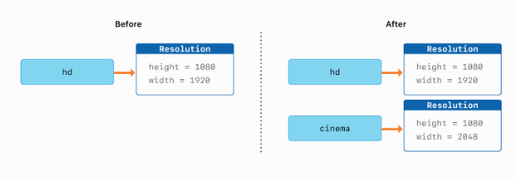

# 結構和類別

- [類別和結構的比較](#comparing_classes_and_structures)
- [結構和列舉是值型別](#structures_and_enumerations_are_value_types)
- [類別是參考型別](#classes_are_reference_types)
- [類別和結構的選擇](#choosing_between_classes_and_structures)
- [集合（collection）型別的賦值與複製行為](#assignment_and_copy_behavior_for_collection_types)

類別和結構是人們構建程式碼所用的一種通用且靈活的構造。為了在類別和結構中實作各種功能，我們必須要嚴格按照對於常數、變數以及函式所規定的語法規則來定義屬性和添加方法。

與其他程式語言所不同的是，Swift 並不要求你為自定義類別和結構去創建獨立的標頭檔和實作檔。你所要做的是在一個單一文件中定義一個類別或者結構，Swift 會自動生成其它程式碼能使用的標頭檔。

>  注意：  
通常一個`類別`的實例被稱為`物件`。然而在 Swift 中，類別和結構的關係要比在其他語言中更加的密切，本章中所討論的大部分功能都可以用在類別和結構上。因此，我們會主要使用`實例`而不是`物件`。

<a name="comparing_classes_and_structures"></a>
### 類別和結構的比較

Swift 中類別和結構有很多共同點。共同處在於：

* 定義屬性用於儲存值
* 定義方法用於提供功能
* 定義subscript[]用於存取值
* 定義建構式用於生成初始值
* 透過擴展以增加預設實作的功能
* 符合協定以對某類別提供標準功能


與結構相比，類別還有如下的附加功能：

* 繼承允許一個類別繼承另一個類別的特徵
* 型別轉換允許在執行時檢查和解釋一個類別實例的型別
* 解構式允許一個類別實例釋放任何其被分配的資源
* 參考計數允許對一個類別的多次參考


> 注意： 
>  
結構是`Value Type`在程式碼中傳遞時總是被複製過去，且不使用參考計數。

### 定義方式

類別和結構有著類似的定義方式。我們通過關鍵字`class`和`struct`來分別表示類別和結構，並在一對大括號中定義它們的具體內容：

```swift
class SomeClass {
	// class definition goes here
}
struct SomeStructure {
	// structure definition goes here
}
```

>  注意： 
>   
在你每次定義一個新類別或者結構的時候，實際上你是有效地定義了一個新的 Swift 型別。因此請使用 `UpperCamelCase` 這種方式來命名（如 `SomeClass` 和`SomeStructure`等），以便符合標準Swift 型別的大寫命名風格（如`String`，`Int`和`Bool`）。相反的，請使用`lowerCamelCase`這種方式為屬性和方法命名（如`framerate`和`incrementCount`），以便和類別區分。

以下是定義結構和定義類別的示例：

```swift
struct Resolution {
	var width = 0
	var heigth = 0
}
class VideoMode {
	var resolution = Resolution()
	var interlaced = false
	var frameRate = 0.0
	var name: String?
}
```

在上面的示例中我們定義了一個名為`Resolution`的結構，用來描述一個顯示器的解析度。這個結構包含了兩個名為`width`和`height`的儲存屬性。儲存屬性是捆綁和儲存在類別或結構中的常數或變數。當這兩個屬性被初始化為整數`0`的時候，它們會被推斷為`Int`型別。

在上面的示例中我們還定義了一個名為`VideoMode`的類別，用來描述一個視訊顯示器的特定模式。這個類別包含了四個儲存屬性變數。第一個是*解析度*，它被初始化為一個新的`Resolution`結構的實例，具有`Resolution`的屬性型別。新的`VideoMode`實例同時還會初始化其它三個屬性，它們分別是，初始值為`false`（意為 non-interlaced video）的`inteflaced`，畫面更新率初始值為`0.0`的`frameRate`和值為可選`String`的`name`。`name`屬性會被自動賦予一個預設值`nil`，意為「沒有`name`值」，因它是一個可選型別。

### 類別和結構實例

`Resolution`結構和`VideoMode`類別的定義僅描述了什麼是`Resolution`和`VideoMode`。它們並沒有描述一個特定的解析度（resolution）或者視訊模式（video mode）。為了描述一個特定的解析度或者視訊模式，我們需要生成一個它們的實例。

生成結構和類別實例的語法非常相似：

```swift
let someResolution = Resolution()
let someVideoMode = VideoMode()
```

結構和類別都使用建構式語法來生成新的實例。建構式語法的最簡單形式是在結構或者類別的型別名稱後跟隨一個空括弧，如`Resolution()`或`VideoMode()`。這種方式所創建的類別或者結構實例，其屬性會被初始化為預設值。

### 屬性存取

通過使用*點語法*（*dot syntax*）,你可以存取實例中所含有的屬性。其語法規則是，實例名後面緊跟屬性名，兩者通過點號(.)連接：

```swift
print("The width of someResolution is \(someResolution.width)")
// 輸出 "The width of someResolution is 0"
```

在上面的範例中，`someResolution.width`表示`someResolution`的`width`屬性，回傳`width`的初始值`0`。

你也可以存取子屬性，如何`VideoMode`中`Resolution`屬性的`width`屬性：

```swift
print("The width of someVideoMode is \(someVideoMode.resolution.width)")
// 輸出 "The width of someVideoMode is 0"
```

你也可以使用點語法為屬性變數賦值：

```swift
someVideoMode.resolution.width = 1280
print("The width of someVideoMode is now \(someVideoMode.resolution.width)")
// 輸出 "The width of someVideoMode is now 1280"
```

### 結構型別的智慧型成員建構式(Memberwise Initializers for structure Types)

所有結構都有一個自動生成的成員建構式，用於初始化新結構實例中成員的屬性。新實例中各個屬性的初始值可以通過屬性的名稱傳遞到成員建構式之中：

```swift
let vga = resolution(width:640, heigth: 480)
```

與結構不同，類別實例沒有預設的成員建構式。

<a name="structures_and_enumerations_are_value_types"></a>
## 結構和列舉是值型別

值型別被賦予給一個變數，常數或者本身被傳遞給一個函式的時候，實際上操作的是其的拷貝。

在之前的章節中，我們已經大量使用了值型別。實際上，在 Swift 中，所有的基本型別：整數（Integer）、浮點數（floating-point）、布林值（Booleans）、字串（string)、陣列（array）和字典（dictionary），都是值型別，並且背後都是以結構的形式實作。

在 Swift 中，所有的結構和列舉都是值型別。這意味著它們的實例，以及實例中所包含的任何值型別屬性，在程式碼中傳遞的時候都會被複製過去。

請看下面這個示例，其使用了前一個示例中`Resolution`結構：

```swift
let hd = Resolution(width: 1920, height: 1080)
var cinema = hd
```

在以上示例中，宣告了一個名為`hd`的常數，其值為一個初始化為 full HD 解析度（`1920`畫素寬，`1080`畫素高）的`Resolution`實例。

然後示例中又宣告了一個名為`cinema`的變數，其值為之前宣告的`hd`。因為`Resolution`是一個結構，所以`cinema`的值其實是`hd`的一個拷貝副本，而不是`hd`本身。儘管`hd`和`cinema`有著相同的寬（width）和高（height）屬性，但是它們是兩個完全不同的實例。

下面，為了符合數位電影院放映的需求（`2048`畫素寬，`1080`畫素高），`cinema`的`width`屬性需要作如下修改：

```swift
cinema.width = 2048
```

這裡，將會顯示`cinema`的`width`屬性確已改為了`2048`：

```swift
print("cinema is now  \(cinema.width) pixels wide")
// 輸出 "cinema is now 2048 pixels wide"
```

然而，初始的`hd`實例中`width`屬性還是`1920`：

```swift
print("hd is still \(hd.width	) pixels wide")
// 輸出 "hd is still 1920 pixels wide"
```

在將`hd`賦予給`cinema`的時候，實際上是複製`hd`中所儲存的*值*（*values*），並儲存到新的`cinema`實例中。結果就是兩個完全獨立的實例碰巧包含有相同的數值。由於兩者相互獨立，因此將`cinema`的`width`修改為`2048`並不會影響`hd`中的寬（width）。



列舉也遵循相同的行為準則：

```swift
enum CompassPoint {
	case North, South, East, West
	mutating func turnNorth() {
        self = .north
    }
}
var currentDirection = CompassPoint.West
let rememberedDirection = currentDirection
currentDirection.turnNorth()

print("The current direction is \(currentDirection)")
print("The remembered direction is \(rememberedDirection)")
// Prints "The current direction is north"
// Prints "The remembered direction is west

```

上例中`rememberedDirection`被賦予了`currentDirection`的值（value），實際上它被賦予的是值（value）的一個拷貝。賦值過程結束後再修改`currentDirection`的值並不影響`rememberedDirection`所儲存的原始值（value）的拷貝。

<a name="classes_are_reference_types"></a>
## 類別是參考型別

與值型別不同，參考型別在被賦予到一個變數，常數或者被傳遞到一個函式時，操作的並不是其拷貝。因此，參考的是已存在的實例本身而不是其拷貝。

請看下面這個示例，其使用了之前定義的`VideoMode`類別：

```swift
let tenEighty = VideoMode()
tenEighty.resolution = hd
tenEighty.interlaced = true
tenEighty.name = "1080i"
tenEighty.frameRate = 25.0
```

以上示例中，宣告了一個名為`tenEighty`的常數，其參考了一個`VideoMode`類別的新實例。在之前的示例中，這個視訊模式（video mode）被賦予了 full HD 解析度（`1920 x 1080`）的一個拷貝（`hd`）。同時設置為交錯（interlaced）,命名為`"1080i"`。最後，其畫面更新率是每秒`25.0`幀。

然後，`tenEighty` 被賦予名為`alsoTenEighty`的新常數，同時修改`alsoTenEighty`的畫面更新率：

```swift
let alsoTenEighty = tenEighty
alsoTenEighty.frameRate = 30.0
```

因為類別是參考型別，所以`tenEight`和`alsoTenEight`實際上參考的是相同的`VideoMode`實例。換句話說，它們只是同一個實例的兩種叫法。


下面，透過`tenEighty`的`frameRate`屬性，我們會發現它正確的顯示了基本`VideoMode`實例新的畫面更新路，其值為`30.0`：

```swift
print("The frameRate property of tenEighty is now \(tenEighty.frameRate)")
// 輸出 "The frameRate property of theEighty is now 30.0"
```

需要注意的是`tenEighty`和`alsoTenEighty`被宣告為*常數（constants）*而不是變數。然而你依然可以改變`tenEighty.frameRate`和`alsoTenEighty.frameRate`,因為這兩個常數本身不會改變。它們並不`儲存`這個`VideoMode`實例，僅僅是對`VideoMode`實例的參考。所以，改變的是被參考的基礎`VideoMode`的`frameRate`參數，而不改變常數的值。

### 識別運算子

因為類別是參考型別，有可能有多個常數和變數在後台同時參考某一個類別實例。（對於結構和列舉來說，這並不成立。因為它們作值型別，在被賦予到常數，變數或者傳遞到函式時，總是會被拷貝。）

如果能夠判定兩個常數或者變數是否參考同一個類別實例將會很有幫助。為了達到這個目的，Swift 內建了兩個恆等運算子：

* 等價於（`===`)
* 不等價於（`!==`）

以下是運用這兩個運算子檢測兩個常數或者變數是否參考同一個實例：

```swift
if tenEighty === alsoTenTighty {
	print("tenTighty and alsoTenEighty refer to the same Resolution instance.")
}
//輸出 "tenEighty and alsoTenEighty refer to the same Resolution instance."
```

請注意「等價於」（用三個等號表示，`===`） 與「等於」（用兩個等號表示，`==`）的不同：

* 「等價於」表示兩個類型別（class type）的常數或者變數參考同一個類別實例。
* 「等於」表示兩個實例的值「相等」或「相同」，判定時要遵照類別設計者定義定義的評判標準，因此相比於「相等」，這是一種更加合適的叫法。

當你在定義你的自定義類別和結構的時候，你有義務來決定判定兩個實例「相等」的標準。

### 指標

如果你有 C，C++ 或者 Objective-C 語言的經驗，那麼你也許會知道這些語言使用指標來參考記憶體地址。一個 Swift 常數或者變數參考一個參考型別的實例與 C 語言中的指標類似，不同的是並不直接指向記憶體中的某個地址，而且也不要求你使用星號（`*`）來表明你在創建一個參考。Swift 中這些參考與其它的常數或變數的定義方式相同。

<a name="choosing_between_classes_and_structures"></a>
